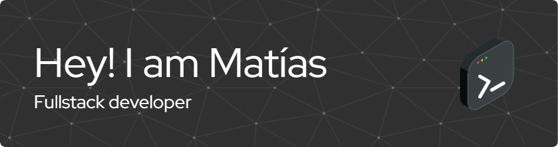

# Hi there

Recently Fullstack graduate with a passion for backend development leveraging my skills in MERN stack and a foundational understanding of AWS. I'm eager to contribute to challenging projects at innovative companies alongside experienced professionals, fostering my growth as a developer.

## Technologies 💻

 

 

 

  
